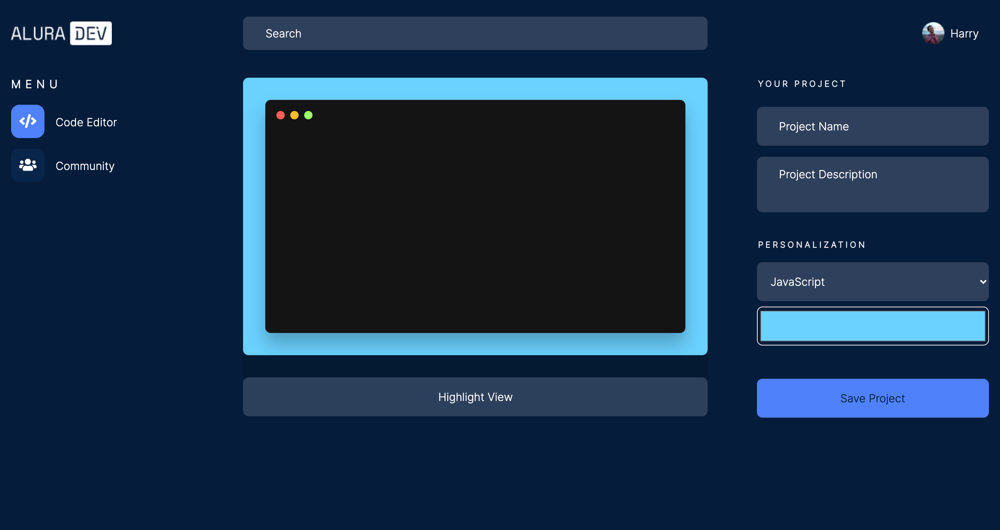
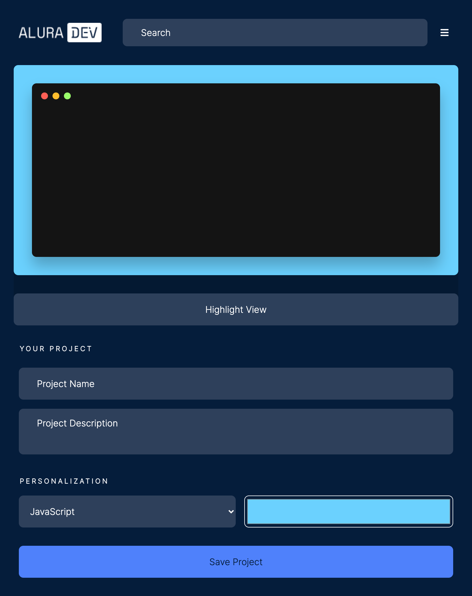
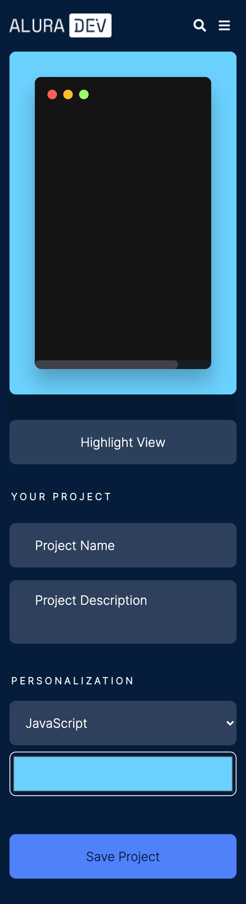
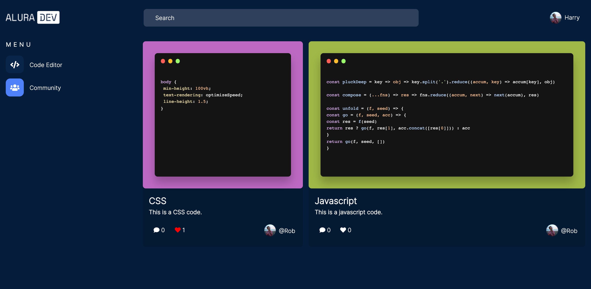
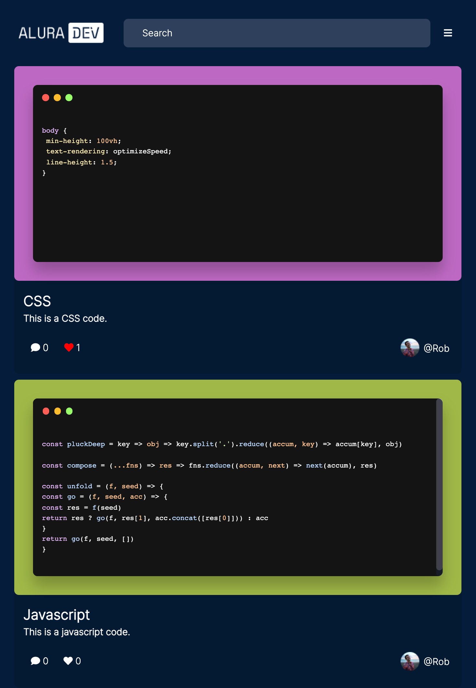
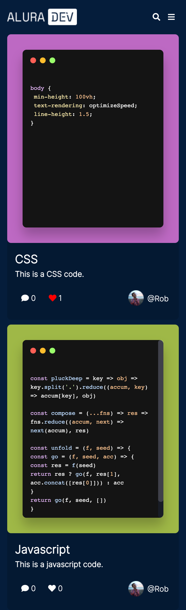

# Alura Challenge Front-End

A Front-End challenge created by [Alura](https://www.alura.com.br/challenges/front-end-2/).


## Table of contents

- [Overview](#overview)
  - [The challenge](#the-challenge)
  - [Live](#live)
- [Screenshot](#screenshot)
- [My process](#my-process)
  - [Built with](#built-with)
  - [What I learned](#what-i-learned)
- [Author](#author)


## Overview

### The challenge

A programming content producer asked to build an online text editor to postcode snippets on their social networks. For him, the editor needs to have an accessible, simple, beautiful, and functional layout to even share the tool with his followers.

The main features requested are:

- A field to select a language to be written;
- A text field of writing the code, and a button to view this code with syntax highlighting and with a lovely theme;
- This project must be scalable, to the point that if it is needed to add some functionality (feature), it will be simple to do so;
- As this editor is online, it should be responsive.

Users will be able to:

- Edit the code and set the highlight;
- Save project in the community tab;
- Check project on the community tab;
- Projects remain in the community tab;
- Like saved projects;
- Search by language name on community tab.


### Live
- [Live](https://aramatsolrac.github.io/alura-challenge-front-end/index.html)


### Screenshot

<details>
<summary>Index Screenshots</summary>

##### Desktop


##### Tablet


##### Mobile

</details>
<details>
<summary>Community Screenshots</summary>

##### Desktop


##### Tablet


##### Mobile


</details>


## My process


### Built with
- Semantic HTML5 markup
- CSS custom properties
- Flexbox
- JavaScript
- Firebase


### What I learned
- Use libraries like: Highlight JS;
- Use firebase;
- Group development, helping and being helped in discord;
- Use trello to organize my tasks;


```html
<h1>Some HTML code I'm proud of</h1>

 <div class="header__mobile__search" id="search-mobile">
    <div class="header__mobile__search__input icon-inside">
      <input type="search" id="mobile-search-bar" class="input-select" style="display: none;" aria-label="Search" placeholder="Search">
        <i id="close-search" class="fas fa-times icon-menu" style="display: none;" aria-hidden="true"></i>
    </div>
    <button id="search-icon" class="btn-search icon-menu">
      <i class="fas fa-search" aria-hidden="true"></i>
    </button>
</div>
```

```css
.proud-of-this-css {}

@media screen and (min-width: 1025px) {
    .container__codes {
        display: grid;
        grid-template-columns: repeat(auto-fit, minmax(25rem, auto));
        grid-auto-rows: minmax(6.25rem, auto);
        gap: 1em;
        width: 100%;
    }
}
```

## Author

- Linkedin - [Tamara Carlos](https://www.linkedin.com/in/tamaracarlos/)
- Twitter - [@aramatsolrac](https://twitter.com/aramatsolrac)

